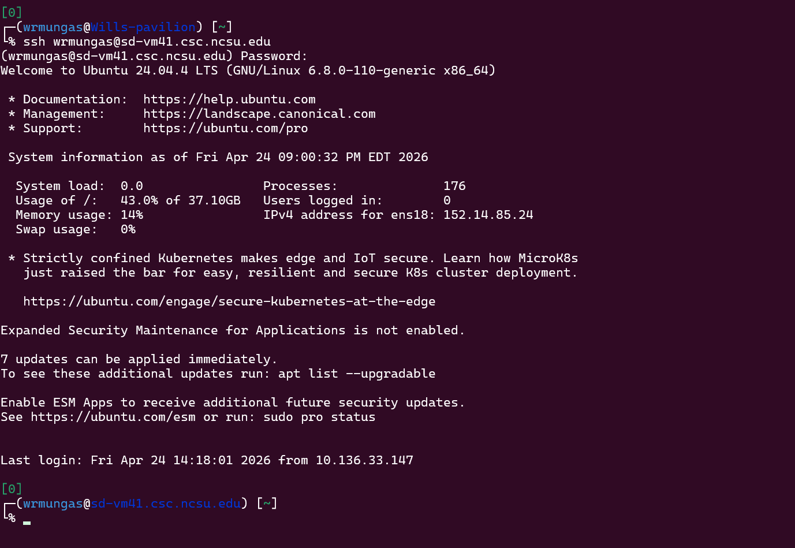
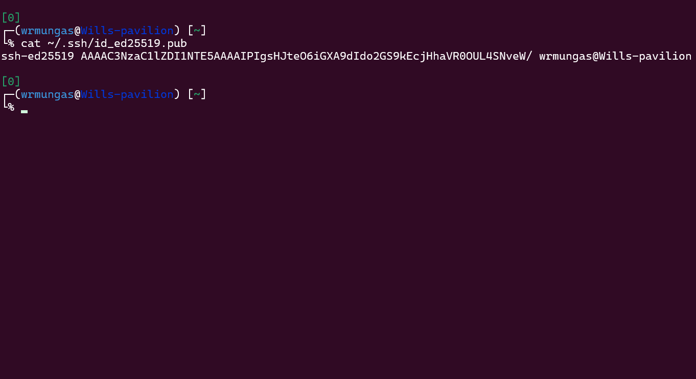
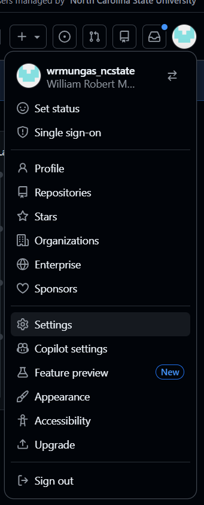
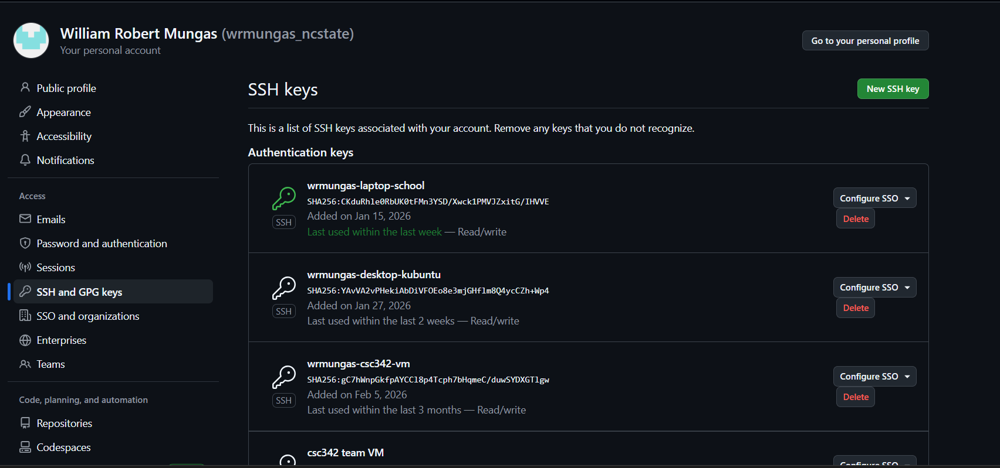
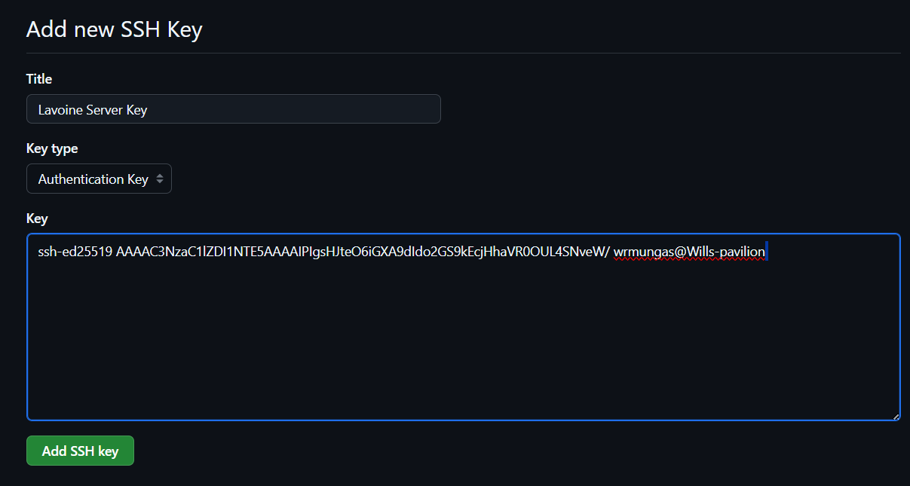
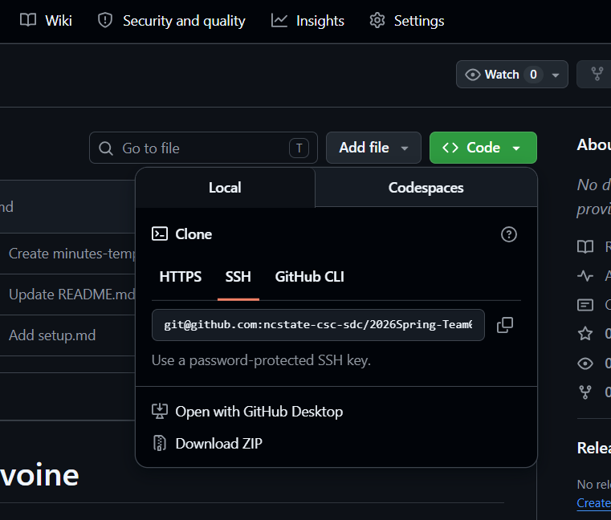

# Introduction

This guide is for anyone seeking to deploy the Sustainable Box Trivia Game ("the application" or "the project") to a state where it can be accessed by others, whether for playtesting or real-world use.

For information on developing the application in general, see the [developer guide](./Developer%20Guide.md).

For information on how to use the application once deployed, see the [user's manual]().

### Contents
1. [Overview](#1-overview)
2. [Requirements](#2-requirements)
3. [Remote Access](#4-remote-access)
4. [Copying Files](#5-copying-files)
5. [Configuration](#6-configuration)
6. [Building and Running](#7-building-and-running)

[Shell Reference](#3-shell-reference)

# 1. Overview

The basic steps of deployment are:
1. Configure/acquire server machine
2. Access the server
3. Copy project files to the server
4. Edit environment variables
5. Build and start the project with Docker

During development, our team deployed the application for remote testing to a Virtual Machine (VM) requested from and provided by the CSC department staff. We requested an Ubuntu Linux server installation with two ports open:
- 22: remote command-line access via SSH for development
- 80: normal HTTP traffic so users can visit the running website

We accessed the server remotely via `ssh` and cloned our project files (using `git`) into the directory `/srv/lavoine-trivia/`. After setting up the `.env` file, starting the application was as simple as running the `rebuild` script.

Our goal with this guide is to be accessible and thorough. The project is not particularly difficult to set up with the technologies we used, and there are other, similar ones that you the deployer might prefer. The steps should be consistent regardless. We do not assume technical expertise on your part and provide explanations for technical details/activities.

## Terms

We first define a few key terms we use in this guide:

1. *machine*: 

    A stationary computer, like a desktop or server rack.

2. *server*: 
    
    The machine that hosts our project and provides access to the website once it is running.

3. *directory*: 

    Interchangable with 'folder', preferred term among developers. A type of file on a computer that contains other files.

4. *operating system (OS)*: 

    Software that acts as a layer between the hardware of a machine and programs or people which use it. Among other things, manages: 
    - users 
    - programs
    - files/memory
    
    Examples include Windows, Mac, iOS, Android, and Linux. 

5. *virtual machine (VM)*:

    A simulated machine/OS running *within* an existing machine/OS. Often used to guarantee that software is run in a consistent, closed ("sandboxed") environment. Software run within a VM only sees the simulated machine/OS, and is not aware of the host machine/OS beyond. 

    For example, you could use a VM to run Windows XP from a modern Mac installation. The programs run in the VM would only see the Windows XP environment.

6. *container*:

    Containers are lightweight virtual machines managed by the Docker software. We use them to split our application into distinct components, and guarantee that each one runs in a consistent environment. If your machine can run Docker, it can run our application.

7. *terminal*: 

    Also called a 'shell'; a program that allows a user to type and execute textual commands, forming a *command-line interface* (CLI). Most users do work on computers with a *graphical user interface* (GUI) through mouse actions like clicks and drags instead; however, developers prefer a shell for its power and precision when performing computer tasks. 
    
    With shell commands, deploying our application is fairly straightforward. We provide a [reference](#shell-reference) section below as an overview of the basics of shell commands and describe all commands used in the deployment steps.

# 2. Requirements

You should at least be familiar with your own machine, including running programs and navigating its file/directory structure. You should have access to a terminal program; see the [reference](#shell-reference) section below.

You must be able to access our project files. You may already have them packaged as a `zip`. The files may instead be hosted on NCSU Github, in which case you must use `git` to clone the project. We will go over how to get the files on the server in both cases.

You must have access to a server. This can be physical or remote access. You might have physical access if the server is a repurposed desktop or laptop. For remote access, we recommend using `ssh`. You can also use remote clients with a GUI if you are familiar with one.

You do not *need* administrative permissions on the server as long as you can edit/create/run files and programs *somewhere* on it - like your home directory. Admin privileges will come in handy if you need to clear the database, however.

The major requirements for the server are:
- Docker software installed
- `git` software installed (if the developer does not have the project files already, and they are still hosted on NCSU Github)
- A decent internet connection within the NCSU network
- Port 80 (HTTP) must be open for users to connect to the running website

If the deployer is using SSH for remote access (recommended), port 22 must also be open and the server must be configured to accept SSH connections

The only major requirement for hardware is that the server can run Docker with four containers, so see the minimum recommended specs for Docker software for guidance. As a minimum, a machine with a CPU from the last 10 years, 4+ GB of RAM, and 4+ GB of disk storage available should do fine. 

The OS does not matter as long as it can run Docker and `git`. We recommend using a lightweight Linux server, accessing it remotely via SSH, and only running Docker with our application on it. This will allow you to use our scripts for easy deployment. The broad steps will not differ much for a Windows server, but some commands may not work or will be different. You should be familiar with how to run commands on the server OS as well as your own machine -  see the [shell reference](#shell-reference) for more info.

The specifics of setting up a server like this are not entirely in our expertise as developers. Our team requested a VM from the CSC IT staff with our requirements - you may be able to do similar. Consult IT staff for additional help. 

# 3. Remote Access

We will assume the use of SSH to access the server remotely. If you can access the server directly, or have chosen to use a different remote client (perhaps with a GUI), feel free to skip this section. Other methods of access work as long as you can navigate the folder structure of the server and run commands in a Bash-compatible terminal.

SSH, or 'secure shell', is a secure networking protocol commonly used to allow access to remote computer systems. We recommend it because it is universal and simple to use. Odds are your machine already has SSH and programs that use it.

To connect to the server via SSH (if you are unfamiliar with a terminal, see the [shell reference](#shell-reference) section):

1. Start a terminal and run the command: `$ ssh <username>@<url>`
    - substitute `<username>` with your username on the server
    - substitute `<url>` with the URL of the server

3. provide a password if prompted and hit ENTER

After this step you should see that your command prompt has changed. It should now refer to the server's hostname instead of your machine's, and your username on the server rather than on your machine. As an example, on our development VM:

The lower prompt indicates that the user `wrmungas` is now logged into `sd-vm41.csc.ncsu.edu`. 

If you see this, congratulations! You are officially "in". The rest of the guide assumes you are on the server via SSH like this.

If the command did not work, it could be for a few reasons:
- you don't have `ssh` on your machine: you should install it and try again
- you are trying to access the server from outside the NCSU network: you must either go to a location on campus where you will be on the NCSU network, or connect to the NCSU VPN remotely with software like Cisco AnyConnect or `openconnect`
- you don't have SSH access to the server: ensure the server is configured correctly to accept your remote access

Consult IT staff for additional help if needed.

# 4. Copying Files

Regardless of how you get the files on the server, you should first choose a place for them to live and navigate there.

(on the server)

`$ mkdir <location>` (if it does not already exist)

`$ cd <location>`

We used `/srv/lavoine-trivia` during development - we chose the top-level directory `/srv` since it is recommended as a location for webserver files on Linux, and we wanted a shared location outside of any individual developer's home directory. Unless you want other users to be able to mess with the project files, a location inside the your home directory (`~/`) will suffice.

If you already have the project files on your machine, you can use the `scp` utility to copy the files onto the server. 

If not, we assume the files are still hosted on NCSU Github, and you can use `git` to copy the project. 

If you have access some other way, we recommend that you copy the files first onto your machine and then use `scp`.

## 4.1 With `scp`

The `scp` (Secure Copy) command allows the user to copy files from one networked host to another. It uses `ssh` under the hood, but you should not be connected to the server when running it.

If you are connected to the server via `ssh` already, do the following to disconnect:

`$ quit`

Then, run:

`$ scp -r <user1>@<host1>:<source> <user2>@<host2>:<destination>`

- `-r` makes the copy command *recursive* - it will copy all subdirectories and their files as well
- `<user1>` and `<host1>` are the username and hostname on the deployer's own machine
- `<user2>` and `<host2>` are the same username and hostname used to access the server with `ssh`
- `<source>` is the directory that the project files are stored in on the deployer's machine
- `<destination>` is the location for the project to live on the server

This will copy the directory `<source>` itself into `<destination>`; use `<source>/.` to copy the *contents* of this directory instead.

After this, reconnect to the server with `ssh` for [configuration](#5-configuration).

## 4.2 With `git`

`git` is used by our development team as version-control for the project. It stores the state of various versions of the project in a structure called a 'repository'. To get the project files you must *clone* the repository to the server from where it is hosted.

If the project is still hosted on NCSU Github, you must pass Single Sign On (SSO) authorization to clone the repo. This requires you to create a cryptographic *key* with`ssh`, add it to your Github account, and authorize it for the project's owning organization.
 
If the repository is hosted somewhere else that doesn't require SSO authorization, this step may be skippable. 

### Create an SSH Key

To generate an `ssh` key (while already on the server):

`$ ssh-keygen -t ed25519`
- accept the default location of `~/.ssh/id_ed25519` unless a different one would be preferable
- the command will prompt for a password; if one is entered, it must also be entered every time a `git` operation is performed. Leave blank to avoid this

Copy the contents of the public key file generated: 
- the location should be `~/.ssh/id_ed25519.pub` unless you chose a different file name, in which case it will be that name with the `.pub` extension
- use `$ cat <file>`  (replace`<file>` with the public key file location) to print the contents into the terminal; copy them

### Add the key to Github

1. visit Github on a web browser and sign in with your account
2. click on your profile in the top right, and select `settings` from the drop-down menu

3. navigate to the section titled "SSH and GPG Keys" from the sidebar on the left

4. select "New SSH Key"
5. give the key a name, and then paste the contents of the public key file (copied in the previous step)

6. Authorize the key:
    - from the "SSH and GPG Keys" screen, locate the new key and select the "configure SSO" option
    - authorize the key with the organization that owns the project - this will redirect to an NCSU authorization service, where you will enter your Unity (or possibly Brickyard) credentials

### Clone the Project

For this step, you need the SSH URL of the project:
1. navigate to the project's Github page
2. select the "Code" button and the "SSH" option in the pop-up that appears
3. copy the displayed URL

Connect to the server with `ssh` and navigate to the project destination directory. Run the following command (note the dot at the end):

`$ git clone <url> .`
- substitute `<url>` for the URL of the project on Github

The dot copies the project files into the current directory; if removed, `git` creates a sub-directory for the project and copies the contents there instead. 

If you would rather do this, run the command without the dot and navigate into the new directory with 
`$ cd <location>` (replace `<location>` with the created sub-directory).

# 5. Configuration

The project uses several environment variables declared in a file called `.env`. For security reasons this file is never added to `git`'s file change tracking; instead we use a file called `.env.template` with sensitive variables left blank to note what is required in the actual `.env`.

To configure the project, you must create `.env` and copy the contents of `.env.template` into it. This can be done with one command: 

`$ cat .env.template > .env`

In the `.env` file, every variable is in SCREAMING_SNAKE_CASE with a trailing equal sign, and the text immediately after that is its value. Any text following a lone `#` is ignored as a comment. Spaces are considered separators. For example:

`THIS_IS_A_VARIABLE=some_value # comment`

You must set the values of:
- `MYSQL_ROOT_PASSWORD`: used internally with your database
- `SERVER_NAME`: the URL of your server
- `GEMINI_KEY`: used for AI integration
- `ADMIN_PASSWORD`: used when changing users in the database - should be secure and known to the teacher who will use the app

You can edit the file remotely in a few ways:
- with in-terminal programs like `nano` or `vim`
- with a text editor that supports remote access through `ssh` like VS Code

## 5.1 Edit with `nano`

Nano is a terminal text editor present universally on modern Linux/Unix machines. It is fairly user-friendly.

Use `$ nano .env` to open the file in Nano.

Use the arrow keys to navigate to variables that are blank. Move the cursor to just after the `=` sign for each, and type the desired values.

Nano lists available commands and user prompts at the bottom of the terminal window. You can perform these key chords to save the file and exit Nano:
1. CTRL + o to 'write out' (save) the file contents
2. Check that the 'name to write' is `.env` to ensure the contents are written back to it
3. Hit ENTER
4. CTRL + x to exit Nano

## 5.2 Edit with `vim`

Vim is an older in-terminal editor still commonly present on most systems. It is a 'modal' editor with a reputation for complexity, but for our purposes no prior knowledge of Vim is required.

Use `$ vim .env` to open the file in Vim. If the machine has NeoVim, use `$ nvim .env`. If the machine has Vi (the precursor to Vim) use `$ vi .env`. All three will work the same.

The deployer should now see the file contents in Vim's View mode.

Edit each variable:
1. Navigation: use arrow keys or H, J, K, and L while in View mode (left, down, up, right, respectively)
2. Place the cursor over the equal sign and hit 'a' to enter editing (Insert) mode at the position right after it; you can also place the cursor at the position after the equal sign and hit `i` to enter Insert mode at the same point
2. Type the value you desire for the variable
3. Hit the ESC key to exit Insert mode and return to View mode
4. Repeat for other variables

To save and exit the file:
1. Hit the ESC key to ensure you are in View Mode 
2. Hit ':' to enter Command Mode
3. Type 'wq' to Write the file and Quit Vim
4. ENTER

If at any point you mess something up, you can use the key sequence ESC + ":q" + ENTER to quit the file without saving.

## 5.3 Edit with VS Code

If you cannot (or would rather not) use a terminal text editor, another good option is using VS Code with the `ssh` extension. 

To connect:

1. Start VS Code on the deployer's own machine
2. Ensure that the "remote editing with ssh" extension is installed:
    - select "Extensions" from the left-hand sidebar menu (the icon with three squares and a diamond arranged in a grid) or perform CTRL + SHIFT + x
    - search for "ssh" and select the Remote - SSH extension that appears near the top of the list
    - select "install" if the extension does not indicate it is already installed
3. Connect to the remote server with the extension: See Microsoft's steps listed under the extension

Open the project folder in VS Code. Then click `.env` from the side panel to open it. 
Edit the variables and save the file (CTRL + s).

# 6. Building and Running

If you have reached this point, congratulations!

Building and running the program is very easy! Navigate to the project directory, then run the `rebuild` script included in the project:

`$ ./rebuild`

This may fail if the file is not executable; to ensure it is executable do:

`$ chmod u+x ./rebuild` 

This changes the "mode" (permissions) of the file to add execution (`x`) privilege for the owning user (`u`). Run the script again after this.

This script will call several commands to:
- clear existing containers
- ask the user whether or not to clear the database (type `n` and hit ENTER)
- rebuild the containers
- ask the user whether to run them (type `y` and hit ENTER).

If this fails, the user can perform the same actions as the script manually by running:

`$ docker compose build`

then 

`$ docker compose up`

If this fails due to the command 'docker' not being found, the Docker Engine may not be running on the server. 

To detach from the stream of text that Docker spits out and run additional commands, hit 'd'. Wait to do this until you see "Server Running on Internal Port" and "Websocker Server Running" messages from the `trivia-api` container to ensure the containers have actually started - this may take several seconds. If you see errors you may want to rebuild again.

## Once Running

To stop the containers manually: 

`$docker compose down -v`

You can rebuild the project at any time with the `rebuild` script. 

You can choose 'y' when prompted to clear the database (requires administrative permissions, since the database files are created by the mariaDB container rather than the current user). Deleting the directory `<project>/database/data/` and its contents will clear the database manually.

The database will automatically insert some starter data: edit the file `database/02-data.sql` to add new data. Changes to this file will only be reflected when the database container is created and no data already exists - clear the database before rebuilding the container.

We suggest that you ensure the teacher and any TA's or developers are automatically added to the users table with appropriate permissions.

## Verify Connection

If you have reached this point, verify that the website is accessible. 

Once Docker has stopped spewing text output into the terminal, and the message "server started on internal port 8080" appears, the application is running and open to external connections. In a web browser, navigate to the URL of the server to connect to it. You should be greeted with the home page of the site.

Congratulations! The application has been successfully deployed. See our [user guide](./User%20Guide.md) for guidance on the features of the application, and the [developer guide](./Developer%20Guide.md) for guidance on development.

# Shell Reference

This section serves as an overview of the basics of running shell commands:
1. Choice of Terminal
2. The Prompt
3. File Paths
4. Running Commands
5. Basic Commands

## 1. Terminal Program

We will assume the use of a terminal that can run Bash commands. This is not a strict requirement - you can certainly perform the same steps in different ways if you know how. However, we recommend it since this is how our existing scripts/commands are written.

On Mac and Linux, these are native with the built-in terminal program. 

On Windows, the deployer has more choices. You can use PowerShell if you like, but our commands are not PowerShell commands. You must be able to translate to the PowerShell equivalents.

Instead, we recommend using one of the following to run our commands without modification:
- Git Bash, which is installed with the `git` software
- MobaXTerm, which includes support for SSH sessions and a GUI for file transfer
- Windows Terminal with WSL, which is a very developer-friendly setup but is significantly more advanced

If you already have a terminal program of choice installed and are familiar with using it, feel free to start the deployment at [remote access](#3-remote-access).

## 2. The Prompt

When the deployer starts a terminal program, they will typically be greeted with a prompt. This is some text that is typically structured like this:

`<user>@<host><location> >`

- `<user>` refers to the deployer's username on their machine
- `<host>` is the *hostname* of the machine
- `<location>` is the *current working directory*. This is a file location that the user is "currently at" in the machine; commands you run will interpret file paths as relative to here
- `>` is just a symbol that indicates the end of the prompt and the start of where the user types commands; the user cannot typically delete beyond this. 

An example prompt might look like this:

`wrmungas@My-PC ~ $`

Here, the user `wrmungas` is logged into the machine `My-PC` and is at the location `~` (shorthand for `wrmungas`' home directory). `$` is the prompt symbol. 

If you see any prompt at all besides the prompt symbol, it should be a file path that denotes the current working directory.

## 3. File Paths

Bash commands use Linux/Mac/Unix-style paths, using a forward slash `/` as a separator. By comparison, Windows paths use backlashes `\` as the separator, and start with a *drive letter* like `C:\` to denote the disk drive that the files are stored on. A Bash-compatible terminal should use the `/` style, but we note the Windows style just in case.

`.` is shorthand for the current working directory, and `..` for its *parent* (the directory that contains it). The *root* directory `/` is the parent directory of the entire file system.

`~` is often used to denote a user's *home directory*. This is a special directory created for each user, where the majority of their files and folders are stored. On Linux this is usually `/home/<username>`, and on Windows it is usually `C:\Users\<username>`.

In a user's home directory, they have complete access to create, modify, and run files/programs. You should be able to setup and run our project from any location within your home directory on the server.

Paths used in commands can be:
- *relative*, starting *without* a leading `/` and interpreted as relative to the current working directory
 - *absolute*, starting with a leading `/` and interpretated as relative to the root directory.

## 4. Running Commands

We denote commands with `$ <name> <arguments>`, where the `$` represents the command-line prompt, `<name>` is the name of the command, and `<arguments>` are additional values that determine its exact behavior. 

We only use a few commands with a few arguments, and we explain each one.

Running a command is simple: type the command text and hit ENTER.

## 5. Basic Commands

The following are a few basic Linux/Unix commands used for file navigation/manipulation from the shell:

- `$ cd <path>`: "change directory"

    changes the current working directory (the user's current location in the file system) to the file path `<path>`. `<path>` is an optional argument; `$ cd` alone will send the user to their home directory

- `$ ls <path>`: "list"
    
    lists the files/directories at a given directory path. `<path>` is again optional; `$ ls` alone will list the files at the user's current working directory.

- `$ mkdir <name>`: "make directory"
    
    creates a new directory with the given name at the current working directory. `<name>` can also have a leading path to specify a different location

One of the most common actions on the shell is `$ cd <location>; ls` - equivalent to saying "go to `<location>` and tell me what is there".