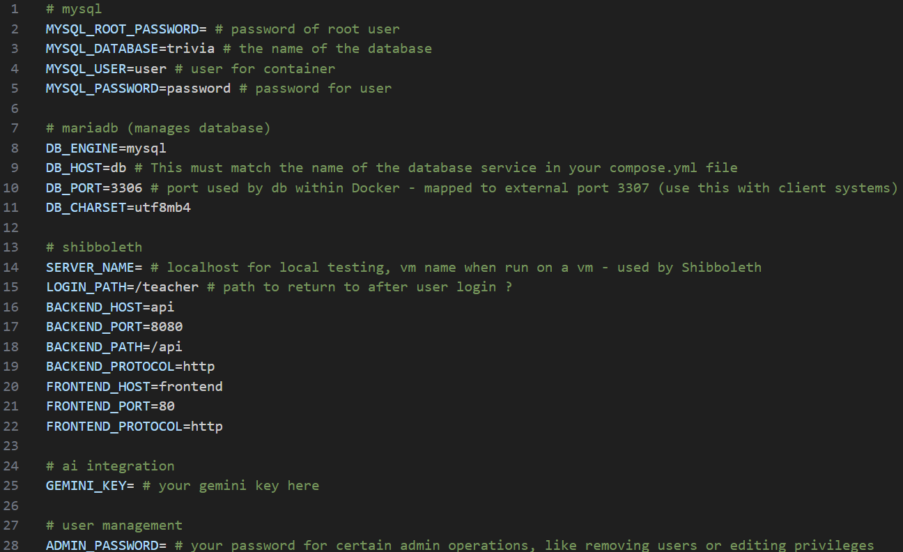
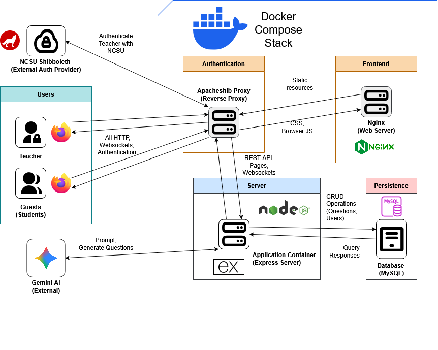

See also (link to user guide), (link to deployment guide)
# Contents
* [Project Technologies](#project-technologies)
  * [Developer tools](#developer-tools)
  * [Local Deployment](#local-deployment)
* [Design Overview](#design-overview)
	* [High Level](high-level)
	* [Docker](docker)
* [Shibboleth](#shibboleth)
* [Page structure](#page-structure)
* [API Calls](#api-calls)
* [Web sockets](#web-sockets)
* [Database Structure](#database-structure)
* [Testing](#testing)

# Project Technologies
## Developer tools
Required
* [git](https://git-scm.com/install/)
* [Docker desktop](https://www.docker.com/products/docker-desktop/)
* [Visual Studio Code](https://code.visualstudio.com/)
Recommended
* VS Code extensions
	* [ESLint](https://marketplace.visualstudio.com/items?itemName=dbaeumer.vscode-eslint)
	* [Container Tools](https://marketplace.visualstudio.com/items?itemName=ms-azuretools.vscode-containers)
	* [Dev Containers](https://marketplace.visualstudio.com/items?itemName=ms-vscode-remote.remote-containers)
	* [Docker](https://marketplace.visualstudio.com/items?itemName=ms-azuretools.vscode-docker)
	* [GitLens](https://marketplace.visualstudio.com/items?itemName=eamodio.gitlens)
* Familiarity with basic docker commands
## Local Deployment

### Clone Repository

Use [git](https://git-scm.com/install/) to clone this repository by typing in `git clone <URL>` with a terminal inside your preferred project folder.

For info on how to do this, see [GitHub Docs](https://docs.github.com/en/repositories/creating-and-managing-repositories/cloning-a-repository).
### Configure Environment Variables

In the root of the repository, copy the `.env.template` file into a `.env` file at the same location.

Inside the new `.env`, most of the variables are configured for you. However, you will need to set MYSQL_ROOT_PASSWORD, SERVER_NAME, GEMINI_KEY, and ADMIN_PASSWORD.

MYSQL_ROOT_PASSWORD can be any arbitrary password, but make ADMIN_PASSWORD something you will remember, as it will be required to add/edit/delete users in the system.

SERVER_NAME should be localhost for local development, for deployment see [the deployment guide.](#)
### AI integration

This is not required to add questions manually, but without a valid API key, question generation will cause errors if used.

First navigate to https://aistudio.google.com/app/apikey and create a new API key. This can have any name, but ideally something descriptive for this project. 

Then copy the newly created key into .env like `GEMINI_KEY=AIzaSyCL-2g2AQ.....`. 

This is all you need to do to setup the AI integration, however, the number of requests will be fairly limited with a free account. If you would like to increase the limit, you may Set up Billing on the same API key you just created.
### Run project on docker
# Design Overview
## High Level

## Docker
See [/docker-compose.yml](/docker-compose.yml)

The Sustainable Box Trivia game('the application') consists of several containers all run in **Docker** containers. Therefore the following environment requires no setup other than what is handled by Docker.

The application uses [apacheshib](https://github.com/ncstate-csc/apacheshib), a preconfigured docker image which acts as a [reverse proxy](https://www.cloudflare.com/learning/cdn/glossary/reverse-proxy/). This receives all external requests before routing them internally within the docker compose stack. The image also allows the application to verify user identity with NCSU's shibboleth service when necessary.

The 'backend' is primarily coded in **Javascript**, using **Node JS**. The API is made accessible via an **Express** server. We also use a **websocket** server in parallel, in order to handle communication associated with gameplay.

The database is a **mysql** instance holding user and question data, accessible inside docker to the 'backend'.

The 'frontend' serves css and client side js from an nginx web server.

Our project also integrates Gemini ai in order to assist teachers with question generation.
# Repository structure 
	app
		backend
			db-queries - Database interface
			game - Core game logic
			middleware - Shibboleth middleware to gate API
			pages - Routers to serve pages
			rest_api - Routers to serve API requests
			templates - Main html pages
			tests
			Dockerfile
			package.json
			server.js
		frontend - Contains static assets(css, js) but NOT main html pages
	shared
		ws-api.js - Websocket api shared between client & server
	docker-compose.yml - Creates the docker structure shown in Design Overview
# Shibboleth

# Page structure

# API Calls

# Web sockets
Note that some signals in ws-api.js are unused, but all the used signals are documented in 

# Database Structure

# Testing
