For info on how to use our application, see [User Guide](./User%20Guide.md).

For info on how to deploy this application to a server, see [Deployment Guide](./Deployment%20Guide.md).
# Contents
* [Project Technologies](#project-technologies)
  * [Developer tools](#developer-tools)
  * [Local Deployment](#local-deployment)
* [Design Overview](#design-overview)
	* [High Level](#high-level)
	* [Docker](#docker)
* [Shibboleth](#shibboleth)
* [Frontend structure](#frontend-structure)
	* [Game client scripts](#game-client-scripts)
* [API Calls](#api-calls)
* [Web sockets](#web-sockets)
	* [Connection](#connection)
	* [Protocol](#protocol)
	* [Code and Usage](#code-and-usage)
* [Database Structure](#database-structure)
	* [Users](#users)
	* [Questions](#questions)
* [Testing](#testing)
	* [Setup Tests](#setup-tests)
	* [Run Tests](#run-tests)
	* [Writing Tests](#writing-tests)
* [Example Modification](#example-modification)

# Project Technologies
## Developer tools
Required
* [git](https://git-scm.com/install/)
* [Docker desktop](https://www.docker.com/products/docker-desktop/)
* [Visual Studio Code](https://code.visualstudio.com/)
Required for Testing
* [Node JS - LTS 24](https://nodejs.org/en/download)
Recommended
* VS Code extensions
	* [ESLint](https://marketplace.visualstudio.com/items?itemName=dbaeumer.vscode-eslint)
	* [Container Tools](https://marketplace.visualstudio.com/items?itemName=ms-azuretools.vscode-containers)
	* [Dev Containers](https://marketplace.visualstudio.com/items?itemName=ms-vscode-remote.remote-containers)
	* [Docker](https://marketplace.visualstudio.com/items?itemName=ms-azuretools.vscode-docker)
	* [GitLens](https://marketplace.visualstudio.com/items?itemName=eamodio.gitlens)
* Familiarity with basic docker commands
## Local Deployment

### Clone Repository

Use [git](https://git-scm.com/install/) to clone this repository by typing in `git clone <URL>` with a terminal inside your preferred project folder.

For info on how to do this, see [GitHub Docs](https://docs.github.com/en/repositories/creating-and-managing-repositories/cloning-a-repository).
### Configure Environment Variables

In the root of the repository, copy the `.env.template` file into a `.env` file at the same location.

Inside the new `.env`, most of the variables are configured for you. However, you will need to set MYSQL_ROOT_PASSWORD, SERVER_NAME, GEMINI_KEY, and ADMIN_PASSWORD.

MYSQL_ROOT_PASSWORD can be any arbitrary password, but make ADMIN_PASSWORD something you will remember. It will be required every time you try to add/edit/delete users in the system. In deployment, ADMIN_PASSWORD should be set by the teacher.

SERVER_NAME should be localhost for local development, for deployment see [the deployment guide.](#)
### AI integration

This is not required to add questions manually, but without a valid API key, question generation will cause errors if used.

First navigate to https://aistudio.google.com/app/apikey and create a new API key. This can have any name, but ideally something descriptive for this project. 

Then copy the newly created key into .env like `GEMINI_KEY=AIzaSyCL-2g2AQ.....`. 

This is all you need to do to setup the AI integration, however, the number of requests will be fairly limited with a free account. If you would like to increase the limit, you may Set up Billing on the same API key you just created.
### Run project on docker

First, ensure [Docker desktop](https://www.docker.com/products/docker-desktop/) is installed and running.

Then navigate to the root of the directory `/`,  since this is where `docker-compose.yml` is located.

To run the docker project, simply run

`docker compose up --build`

If you encounter issues with changes not being reflected in the browser, ensure you hard refresh your current page by pressing `Ctrl + Shift + R`.
# Design Overview
## High Level

## Docker
See [docker-compose.yml](/docker-compose.yml)

The Sustainable Box Trivia game('the application') consists of several containers all run in **Docker** containers. Therefore the following environment requires no setup other than what is handled by Docker.

The application uses [apacheshib](https://github.com/ncstate-csc/apacheshib), a preconfigured docker image which acts as a [reverse proxy](https://www.cloudflare.com/learning/cdn/glossary/reverse-proxy/). This receives all external requests before routing them internally within the docker compose stack. The image also allows the application to verify user identity with NCSU's shibboleth service when necessary.

The 'backend' is primarily coded in **Javascript**, using **Node JS**. The API is made accessible via an **Express** server. We also use a **websocket** server in parallel, in order to handle communication associated with gameplay.

The database is a **mariadb** instance holding user and question data, accessible inside docker to the 'backend'. Some variables may still reference MySQL, but they are functionally nearly the same.

The 'frontend' serves css and client side js from an nginx web server.

Our project also integrates Gemini ai in order to assist teachers with question generation.
# Repository structure 
	app
		backend
			db-queries - Database interface
			game - Core game logic
			middleware - Shibboleth middleware to gate API
			pages - Routers to serve pages
			rest_api - Routers to serve API requests
			templates - Main html pages
			tests
			Dockerfile
			package.json
			server.js
		frontend - Contains static assets(css, js) but NOT main html pages
	shared
		ws-api.js - Websocket api shared between client & server
	docker-compose.yml - Creates the docker structure shown in Design Overview
	.env - Your filled out env file should be here
	.env.template
# Shibboleth

See also documentation for the [apacheshib-proxy container](https://github.com/ncstate-csc/apacheshib/blob/main/apacheshib-proxy/README.md).

From Campus IT, "[Shibboleth](https://incommon.org/software/shibboleth/) is a web-based federated authentication system, that allows for authentication across organizational boundaries.". Our application uses Shibboleth to authenticate teachers or any other users who are authorized to access teacher pages. 

To find out more about how users may be added or removed from having teacher permissions, see [Database Structure.](#database-structure) 

We protect certain routes and pages behind middleware defined in [shib-middleware.js](/app/backend/middleware/shib-middleware.js) which, if the user does not have a cookie attached by shibboleth, redirects them to the login page. 

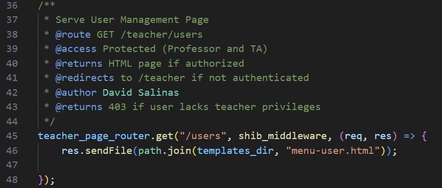

This login page is /teacher by default, as defined in .env as `LOGIN_PATH=/teacher`. This configuration makes the shibboleth reverse proxy container intercept the request and redirect the browser to the login page.

Upon returning from the login page, any requests made by the browser will now contain the username accessible by `req.headers["x-shib-uid"]` which our application then checks against authorized users. 
# Frontend structure

As seen in [Repository Structure](#repository-structure), while css and js are served from the frontend server, the html pages are served from the backend server.

The file `styles.css` applies to all pages, while `games.css`, `questions.css`, and `interactive-box.css` are only applied to certain pages.

The header component used by most pages is created by adding
`<header-component></header-component>` 
in the html of the page, which is then filled in by `/components/header.js`.

## Game client scripts

Game client scripts are contained in the files  `tg-host.js`, `tg-player.js`, and `sg-host.js`. These three files contain the logic enabling the clients(host and player) to communicate with the server via web sockets. See [Web Sockets](#web-sockets) for details on how these files work.

Additionally, `study-game-helpers.js` and `game-helpers.js` contain logic to manipulate the html of the game page, so the user has a continuous gameplay experience without needing to navigate between different pages.

# API Calls

All API calls are routed through an [express](https://expressjs.com/en/guide/routing.html) server, which then are subdivided into several different routers. 

All routes below are prepended by \<host\>/api/
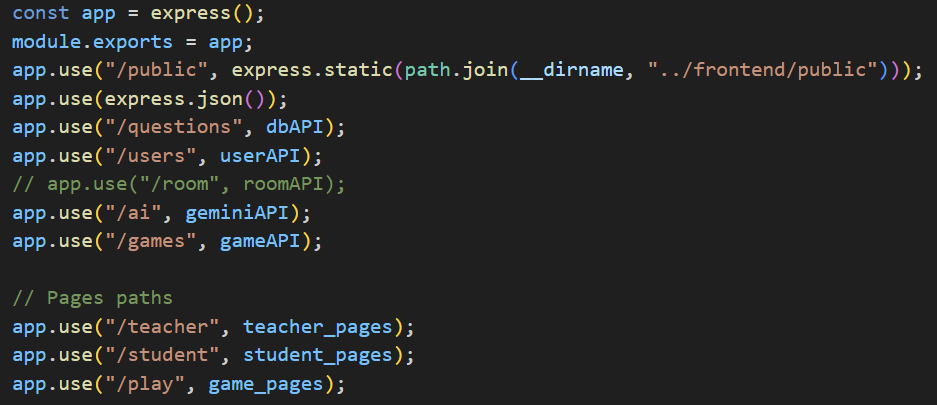

Pages are served by the paths `/teacher`, `/student`, and `/play` (aside from index.html). Details on these pages and their scripts can be found in [Frontend Structure](#frontend-structure). 

API routes are served by the routes `/questions`, `/users`, `/ai`, and `/games`.

Overview of API:
* `GET/POST/PUT/DELETE /api/questions` - CRUD operations for questions
* `GET/POST/PUT/DELETE /api/users` - CRUD operations for users
* `POST /api/ai/gemini` - Prompt gemini AI for question generation
* `GET /api/games/:code` - Check if game session exists
	* Used before opening websocket 
* `POST /api/games/` - Create a game session

All the API routes are well documented, so refer to those files in `/app/backend/rest-api/` for more details.
# Web sockets
Our websocket protocol is handled primarily by the file ws-api.js, which is copied via docker into both the frontend web server and backend. This provides an interface that the rest of the scripts interact with, as an extension of the base javascript websockets.

We highly recommend reading [ws-api.js](http://ws-api.js) for more information.
## Connection

Upon application start, the backend server initializes a websocket server at the same address and port as the http express server, just on a different protocol.

  

The client must initiate connections, and will always first send an ACK signal to test the connection once the websocket is open. 

  

The websocket connection is not the same as a game connection. Once the websocket connection is initiated, the client must then send a JOIN signal to the server with a game session code to be added to that session’s list of users.

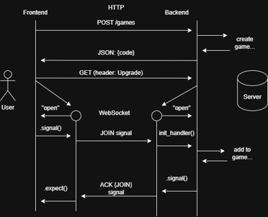
## Protocol

  

Once socket connection is established, they will communicate via a set of messages with a consistent format:

	{
	Type: <signal>
	Body: { <data> }
	}

  

The type, body, and other details for each signal are summarized in the table below:

## Valid Signals:

| Type           | Game | Sent by              | Body                                                                                                                                                                                                                                  | Details                                                                                                                                                                                                                                                  |
| -------------- | ---- | -------------------- | ------------------------------------------------------------------------------------------------------------------------------------------------------------------------------------------------------------------------------------- | -------------------------------------------------------------------------------------------------------------------------------------------------------------------------------------------------------------------------------------------------------- |
| ERR            | All  | All                  | err: String                                                                                                                                                                                                                           | Ability for either to communicate an error.                                                                                                                                                                                                              |
| ACK            | All  | All                  | msg: String                                                                                                                                                                                                                           | When a client initiates a websocket connection, they will send this signal with a message of choice to test the connection and ensure signal handling is set up.      Also used by the server to acknowledge the client’s sent answer choice |
| RES            | All  | All                  | to: String  success: Boolean                                                                                                                                                                                                    | Used internally by ws-api for responding to certain messages                                                                                                                                                                                             |
| JOIN           | All  | Client               | name: String  code: String                                                                                                                                                                                                      | Client joins game session, sending an optional name field      First joining client is considered the host                                                                                                                                   |
| JOINED(unused) |      |                      |                                                                                                                                                                                                                                       |                                                                                                                                                                                                                                                          |
| REJECTED       | All  | Server               | code: String                                                                                                                                                                                                                          | sent by the server when a client fails to join a game session                                                                                                                                                                                            |
| JOINEE         | All  | Server               | code: String                                                                                                                                                                                                                          | sent by the server when a client successfully joins a game session                                                                                                                                                                                       |
| KICK           | All  | Client (Host)        | name                                                                                                                                                                                                                                  | Host kicks a player from the game                                                                                                                                                                                                                        |
| START          | All  | Client  (Host) | rounds: Number  categories: List(Number)  preview: Number  dead: Number  live: Number                                                                                                                         | Host starts game      note that dead time = preview time’s internal name                                                                                                                                                                     |
| QUESTION       | All  | Server               | text: String  num: Number  preview: Number  dead: Number  live: Number  rounds: Number                                                                                                                  | Server gives only text of question                                                                                                                                                                                                                       |
| CHOICES        | All  | Server               | answer_choices: List(String)                                                                                                                                                                                                          | Server gives answer choices, but responses not yet accepted                                                                                                                                                                                              |
| READY          | All  | Server               | (none)                                                                                                                                                                                                                                | Server now accepting question ANSWERs - Any responses before are ignored                                                                                                                                                                                 |
| ANSWER         | All  | Client               | idx: Number                                                                                                                                                                                                                           | Client sends answer                                                                                                                                                                                                                                      |
| DONE           | All  | Server               | correct_idx: Number      data_you: {name, points, answers:List(answer idx)}               class_accuracy_percent: Number                                                                                      | Player clients will display their points/rank only;  Conversely, teacher/host clients will display a list of the top-five highest ranked players      Server will no longer accept question ANSWERs                                    |
| CONTINUE       | All  | Client  (Host) | (none)                                                                                                                                                                                                                                | Host client indicates the game to move to the next question or next screen                                                                                                                                                                               |
| RESULTS        | All  | Server               | data_you: {name, points, latest_answer, List(answer #)}      data_all: List({name, points, latest_answer, List(answer #)})      category_accuracy: List({category_num, accuracy, num_correct, num_questions}) | Server sends results for one round of gameplay                                                                                                                                                                                                           |
| NEXTROUND      | All  | Client               | (none)                                                                                                                                                                                                                                | Host indicates the game should move to next round                                                                                                                                                                                                        |
| FINAL          | All  | Server               | data_you: {name, points, latest_answer, List(answer #)}      data_all: List({name, points, latest_answer, List(answer #)})      category_accuracy: List({category_num, accuracy, num_correct, num_questions}) | Server sends final results for game                                                                                                                                                                                                                      |
| GAMEOVER       | All  | Server               | (none)                                                                                                                                                                                                                                | Server indicates closing of game; server and client will close socket connection                                                                                                                                                                         |

  
  
  

## Code and Usage

The protocol above is encoded into a JavaScript object in shared/ws-api.js. Each signal type is keyed by that name (for example, signals.ERROR) and has an object with its id (the key as a string), the sender (“server”, “client”, or “all”), and a list of fields required at the top level of the message body.

  

The file adapts to both backend and frontend usage. In Node, the file is imported as a module (ex, const ws_api = require(‘./ws-api’)). On the frontend, the file ‘/public/js/ws-api.js’ must be included as the first script in the HTML for any page that uses it. The script will automatically attach ws_api to the window object.

  

The api is used in conjunction with existing WebSocket code: it only adds functions for handling our protocol onto an existing websocket object.

  

Accessible values:

- signals: defined by protocol above
    
- choices: index values for ANSWER signal
    
- games: game types
    
- users: types of user constants
    

  

API Functions:

- init(ws, user, handler, first): for a websocket connection ws, sets ws.user and ws.handler, and adds several helper methods to ws (discussed below). Handles a few low-level common signals by default.
    
- support(handler, signal, callback): for a handler object, adds support for the signal with a given callback of the form (ws, body) where ws is the WebSocket that received the signal and body is the body of the signal (which is provided to the handler already decoded from JSON).
    

  

Methods attached to WS:

  

- signal(sig, body): Sends a signal on the websocket. sig is the type of the signal, and must be one of the signals defined in ws_api.signals. Body is the body of the signal sent alongside the type
    
- respond(sig, success): sends a signal in direct response to another. sig is the signal being responded to, and success is a value (typically a boolean) representing the response to that signal. Explained below in more detail
    
- expect(sig, action): queues an action in anticipation of a RES (response) signal to \<sig>. Explained below in more detail.
    
- err(err): sends an ERR signal
    
- kill(reason):
    

  

Using expect() and respond(): 

These two functions provide a very useful mechanism where one of the two websocket users can send a signal that requests an action, and then check to see whether that action was successful or not and respond to it somehow. The flow for this looks like:

  

1. User one (the requester) calls ws.expect(\<sig>, action) to tell the websocket that it expects a response signal when it next sends \<sig> and provide an action to execute when it receives that response
    
2. The requester calls ws.signal(\<sig>, …) to request the action
    
3. User two (the responder) receives the signal \<sig>
    
4. The responder attempts the action requested by \<sig> and then calls ws.respond(\<sig>, success) to report the results of the attempt
    
5. The requester receives a signal RES with body {to: \<sig>, success}
    
6. The requester does not see the signal directly; instead, action(success) is called automatically by the websocket
    

  

Usually, the requester will be the client and the responder will be the server.

For example: to handle joining game sessions, the client-side code looks like:

  

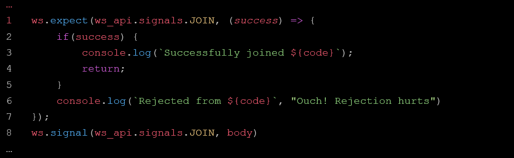

  

The important parts are lines 1 and 8: the client queues its response handler for JOIN before it actually sends JOIN.

  

And (part of) the server-side code looks like:

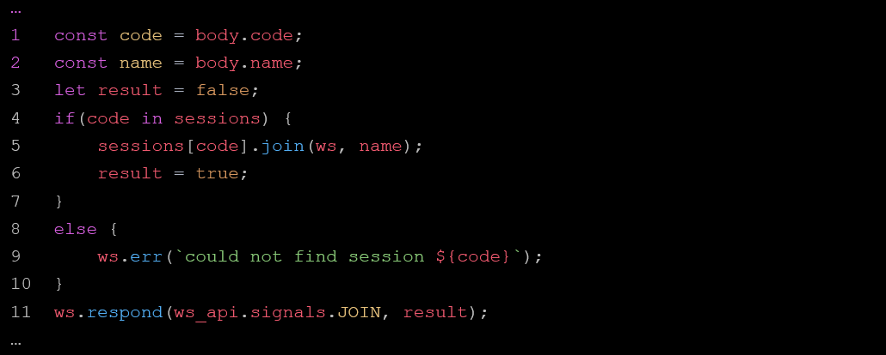
  

The important part is line 11, where the server calls sends its response to the signal JOIN.

Note that the server can still send other signals, like the error message on line 9, without interfering with the expected response cycle. 

  

However, failing to send a response when the client expects one would be an error, as well as sending a response to a different signal than expected. The flow is linear: 

expect(A, action) - send(A) - respond(A) - action(success)
# Database Structure

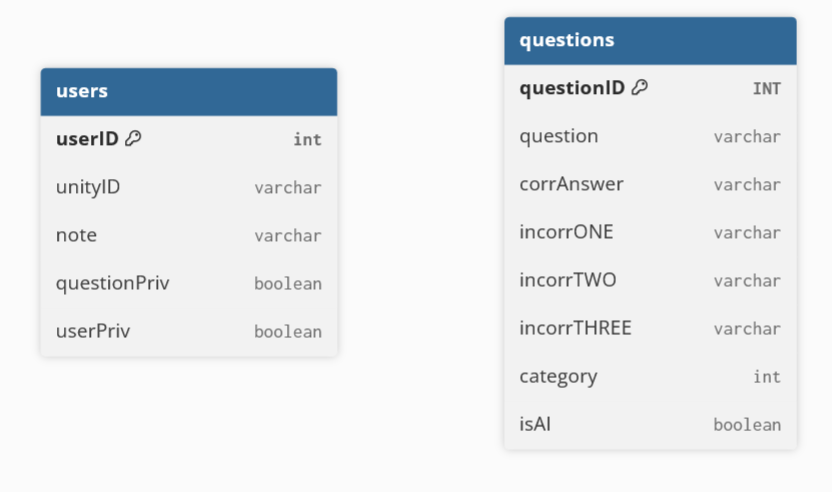
All fields are required.

For information on using the REST API to access the database, see [API Calls](#api-calls).

`/app/backend/db/` Files Overview:
* `db.js` - Helper methods for other files
* `question-dao.js` - methods for CRUD operations on questions
* `question-validation.js` - methods for validating to-be-created questions
* `user-dao.js` - methods for CRUD operations on users
* `user-validation.js` - methods for validating to-be-created users
## Users

When a request is made to change users, the user making the request will have their unityID matched against [shibboleth](#shibboleth) authentication first for validity. Then userPriv will be queried to check permissions. 

User management permissions can be granted during runtime, or by modifying `/app/database/schema/2-data.sql` to add permissions at database initialization.
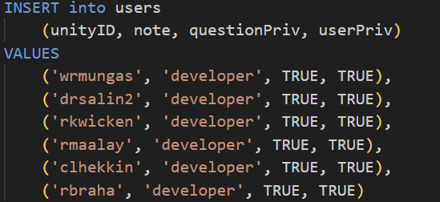

Note that users can **only** have user-management permissions if they are Faculty OR in a list of dev users.

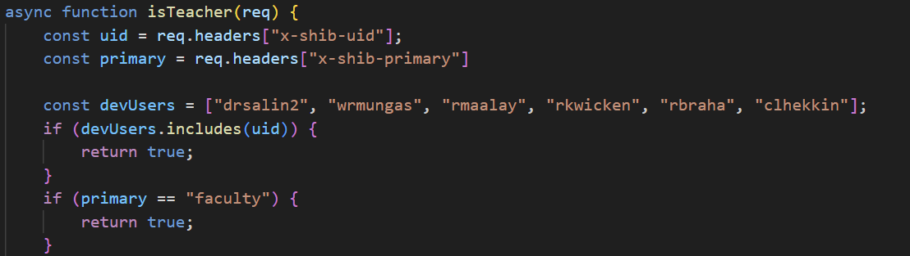
## Questions

Category is a number from 1-6 indicating the category. The isAI label will not be removed from an AI generated question, even if the question is edited by a human.

When a request is made to change questions, the user making the request will have their unityID matched against [shibboleth](#shibboleth) authentication first for validity. Then questionPriv will be queried to check permissions

Question management permissions can be granted during runtime, or by modifying `/app/database/schema/2-data.sql` to add permissions at database initialization.

Note that users can **only** have question-management permissions  if they are Faculty OR in a list of dev users

# Testing

## Setup Tests

Note that testing is done locally(not using docker) and as such, [Node JS - LTS 24](https://nodejs.org/en/download) is required. 

Before running tests, navigate(in a terminal) to 

`/app/backend/` 

and run

`npm install`

to install all required dependencies, including Jest, our testing framework.

## Run Tests

To run the test script, run(inside `/app/backend`)

`npm test`

This runs a script configured in package.json which runs the tests and generates a coverage reports.
## Writing Tests

Tests exist in the test folder `/app/backend/tests`. 

Since testing is currently done without docker, note that database tests must mock the returns from database queries.

For more info on how to write tests, see [Jest Docs](https://jestjs.io/docs/getting-started).

# Example Modification

In this section we will list the steps needed to make a modification to the application. We will use the creation of a third, "multiplayer game" as an example.

First, let us start with the backend.

Begin by creating a new file `/app/backend/game/multiplayer-game.js`. You can model this file after `study-game.js` and `teaching-game.js`, or create a completely different game flow. These files are complex, and we recommend understanding the basics of how they work before writing your own.
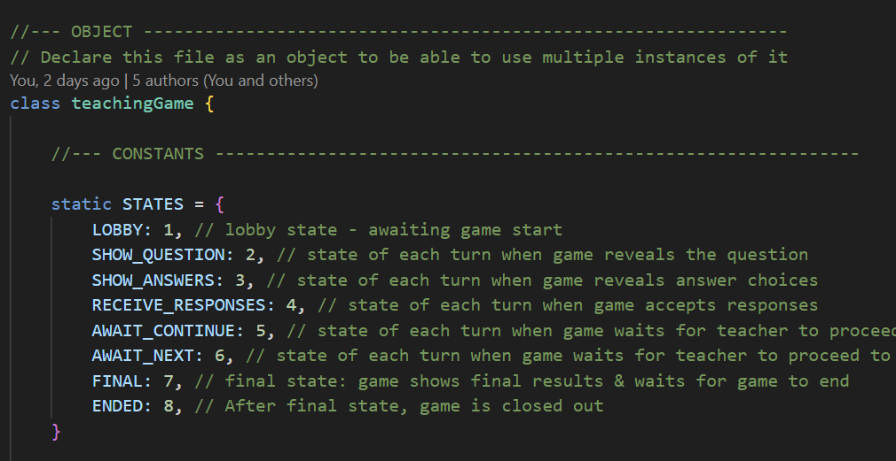

Next, add the game type to `/shared/ws-api.js`.  
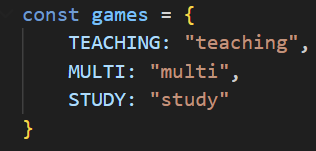
If you did decide to make changes to the web socket messaging from previous games, you will also need those changes to be defined in `ws-api.js` in order for these messages to not be rejected.
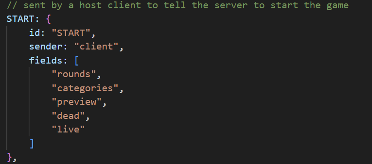

Next, add the new game type in `/app/backend/game/sessions.js`, the file which manages joining and creating sessions. This will import your `multiplayer-game.js`
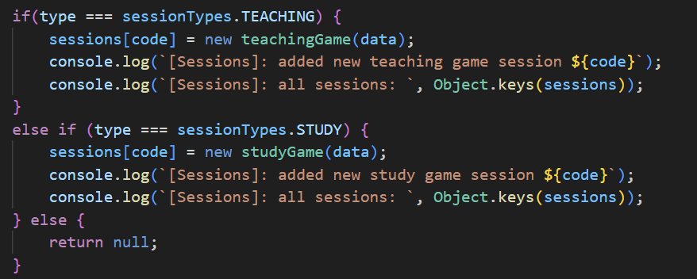

Now, let us move on to the frontend.

Begin this section by creating two new pages in `/app/backend/templates`, `mg-host.html` and `mg-player.html`. In this file, you will want to add a `<header-component>`, link `header.js`, bootstrap, and stylesheets. You will also want to link `/public/js/ws-api.js`, which will initialize the client websocket connection.
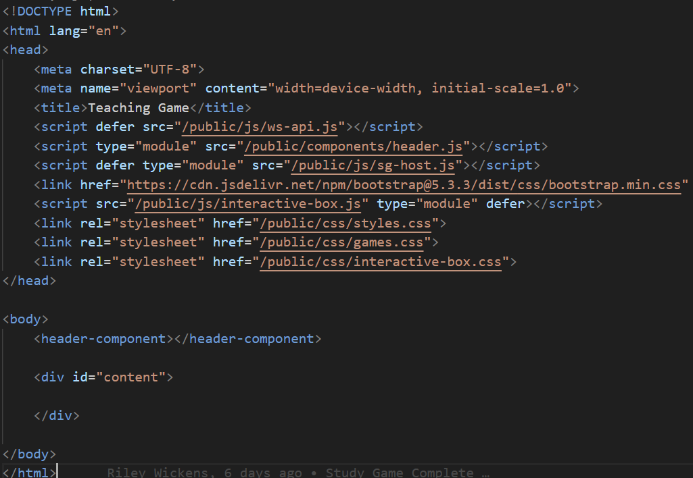
We structured our implementation so that the user would remain on the same html page throughout gameplay, with the html being dynamically modified by js files. We recommend this approach because it gives a more seamless user experience, and the web socket connection won't be broken by navigating away from the page.

This is why `
` is empty, as it will be filled by the js functions. You will also want to link a js file to this page.

``

Next, in `/app/backend/pages/game-pages.js`, create new endpoints to serve your html page.
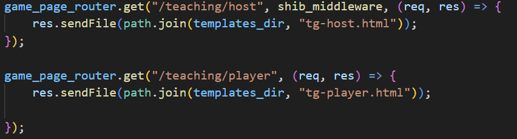

Back to your `/app/frontend/public/mg-host.js` and `mg-player.js` files, you will then define the logic for the client pages to handle web socket messages from the server. We recommend reviewing how this is done in `tg-host.js` or `tg-player.js`, as well as having read the [Websockets](#websockets) section before this is done.
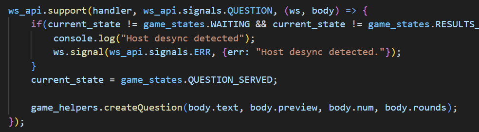

We also recommend using a separate file with helper methods to create and manage the html content, so your `mg-host/player.js` files do not become too cluttered. In our implementation(`game-helpers.js` for example), we use both templated strings and components stored in `/app/frontend/public/templates/question-template.html` to serve as starting points for making and managing the html content the user is presented.
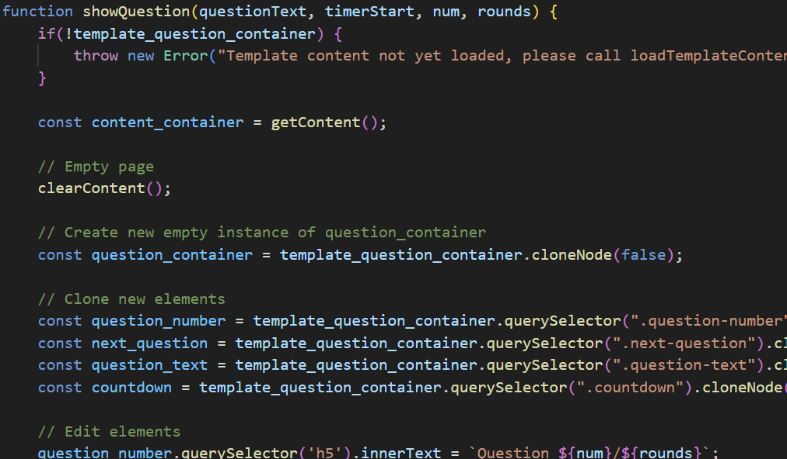

Once you have completed these (very oversimplified) steps, you have everything you need to run a completely new game mode!